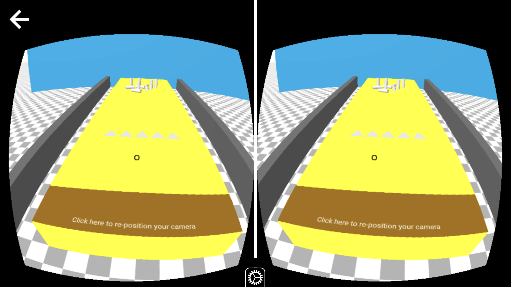

# Build a Multiplayer Browser-based VR Game with A-Frame, PubNub, and WebVR

## Introduction

Recent advancements in technology have made Virtual Reality(VR) more immersive and affordable than ever. This immersive environment can be similar to the real world or it can be fantastical, creating an experience that is not possible in ordinary reality. High-quality VR devices are available at such low prices these days. With all these smartphone-compatible VR headsets such as Google Cardboard, Samsung Gear VR, Oculus Rift and HTC Vive, all that I can say is that VR is the next big thing in the field of technology. With less than 1/4th of a second latency, PubNub can smoothly publish and subscribe messages between multiple VR devices.

Click the image below to watch the game video:

## PubNub

You can signup for PubNub by clicking on these links:

 

